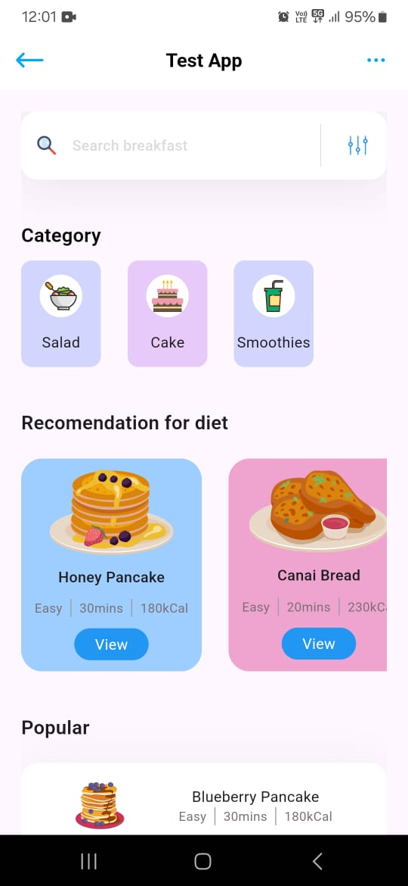
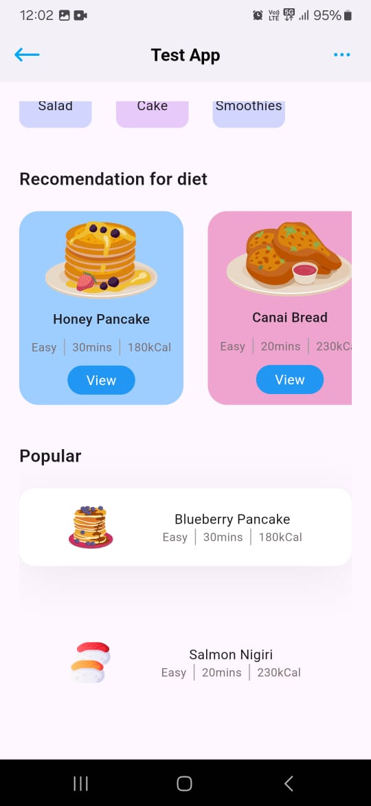

## A basic flutter application 
### *Screenshot of the application*
<div align="center" style="display:flex">
  
  
</div>

### *About the App:*
1. The home page implements ```stateless widget``` since the application doesnt include any kind of usage of states
2. A ```Scaffold``` has been setup that includes the ```appBar``` and a ```body```
3. For the buttons on the appbar we use the ```flutter_svg``` package. The ```SvgPicture.asset()``` function is used to load in all the svgs we use.
4. For using using flutter_svg, we simply write the name of the package in dependencies section of ```pubspec.yaml``` and then run ```flutter pub get``` to download the package
5. To make the svg available for use, we write the path of the SVG in the ```pubspec.yaml```and run ```flutter pub get```
6. For the back button to appear at the left we use the ```leading``` property in the app bar and for the three dots to the right we use ```actions``` property.
7. The body of the scaffold is divided into three parts:
     a. Categories section
     b. Recomendation section
     c. Popular section
8. To display the items in the categories section, we first create a ```models``` folder and then create a class, with a ststic method that returns all the items along with their icon path, title and background colour
9. The Items are stored in a list, in the models class. The items are populated back in a list at the home page. This list popluation is done in the build method of the main widget, so that the list items are available before the widget using the list is rendered on screen
10. The categories are displayed using the ```ListView.separated()``` function. The scroll direction is set to ```Axis.horizontal``` with a ```SizedBox``` as a separator between each list item. The ```itemCount``` and ```itemBuilder``` properties are provided to the ListView.separated function
11. The ```recomendation``` widget goes out of the screen normally. So we have to use the ```ListView``` property to helpin scrolling of the page
12. When we use ```ListView.separated``` method in side another scrollable element like ```ListView``` we generally run into an error. To avoid this error we have to set the  ```shrinkWrap``` property to true in the nested ```ListView.separated``` to make the ListView take up only as much space as is needed according to the sum of size of elements in the ```ListView``` instead of occupying the infinite vertical height given by ```ListView```. Note: Setting ```shrinkWrap``` to true has a performance hit since the size has to be computed dynamically. 

### <p align="center">Thank you for your time and patience ❤️</p>
